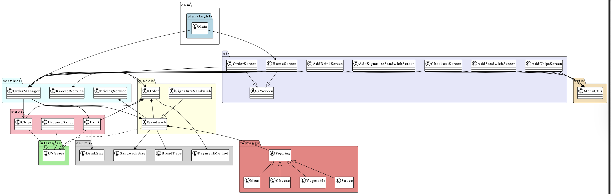
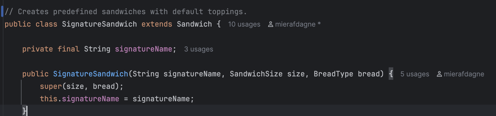
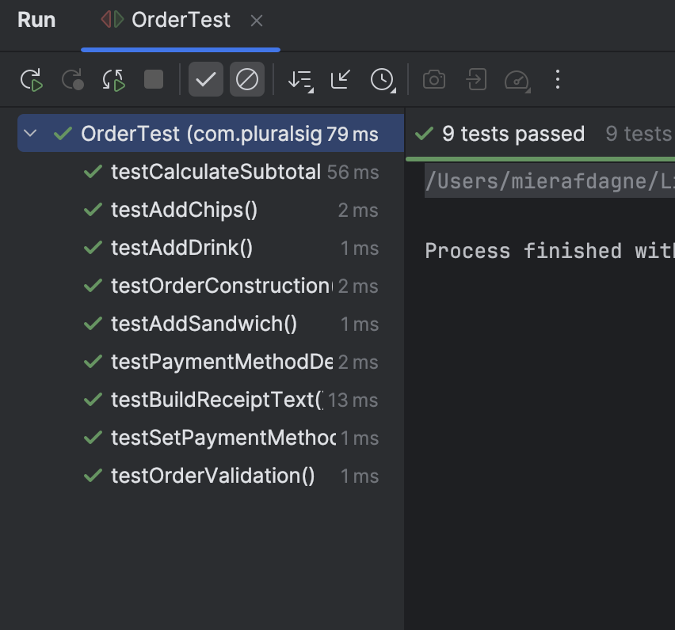
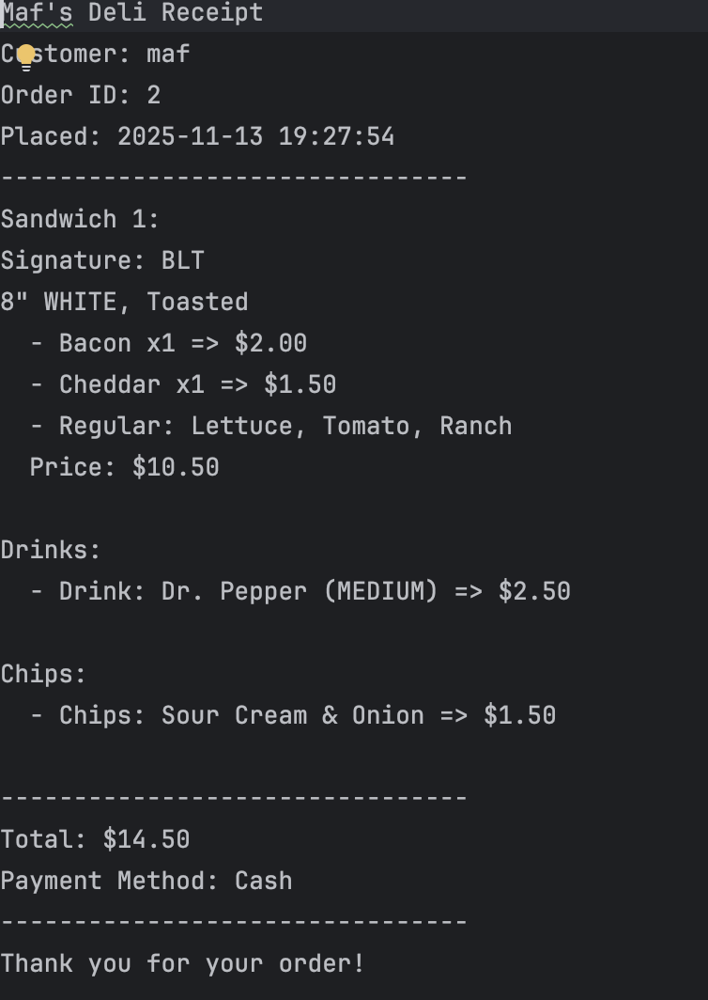

# 🥪 Maf's Deli — Sandwich Point-of-Sale System

## 📘 Overview

**Maf’s Deli** is a console-based Point-of-Sale (POS) application built in **Java**, designed for a customizable sandwich shop.  
It allows users to build sandwiches, choose toppings, add drinks and chips, and generate a **time-stamped receipt** saved automatically to a file.

The project demonstrates **advanced object-oriented programming (OOP)**, **file handling**, **Java Streams**, and **multi-layer software architecture**.

---

## 🎯 Purpose

The goal of this project was to simulate a real-world **deli ordering system** with accurate pricing, customizable items, and automated receipt storage.

This project reinforces major Java concepts such as:

* Abstract classes and interfaces
* Polymorphism and inheritance
* Composition and clean architectural design
* File writing with timestamped receipts
* Enum-based menu modeling
* Stream-based calculations
* Modular UI and service layers

---

## ⚙️ Key Features

* Build fully customizable sandwiches
* Signature sandwiches (BLT, Philly, etc.)
* Add drinks, chips, and sauce sides
* Price calculation using **premium vs. regular toppings**
* Auto-generated receipts stored in `/receipts` folder
* Time-stamped filenames (`yyyyMMdd-HHmmss.txt`)
* Clean, layered package structure
* Uses Java Streams for clean price aggregation
* UI menus for:
    - New order
    - Add sandwich
    - Add drink
    - Add chips
    - Checkout

---

## 🧩 Project Structure

```
src/
└── com/pluralsight/
    ├── Main.java                      
    ├── enums/                         
    ├── interfaces/
    ├── models/
    ├── services/
    ├── ui/
    └── utils/
```

---

## 🧱 Class-by-Class Breakdown

### 🥪 **1. Sandwich.java (Abstract Base Class)**

Represents a general sandwich which custom and signature sandwiches extend.

**Fields:**  
size, breadType, toasted, toppings

**Responsibilities:**  
Holds base sandwich data, provides topping management, receipt formatting, and supports polymorphic pricing.

---

### ⭐ **2. SignatureSandwich.java**

A template-based sandwich (BLT, Philly).  
Demonstrates inheritance + auto-populated toppings.

---


### 🥓 **3. Topping Subclasses**

Includes:
- Meat
- Cheese
- Vegetable
- Sauce

Demonstrates abstract classes + method overriding.

---

### 🍟 **4. Side Items**

Includes:
- Drink
- Chips
- SauceSide

Implements the `Pricable` interface → polymorphic order items.

---

### 🧮 **5. PricingService.java**

Handles:
- Sandwich pricing
- Premium topping upcharges
- Extra toppings
- Drinks and chips

Uses Java Streams for clean summing.

---

### 🧾 **6. ReceiptService.java**

Creates timestamped receipt files such as:

```
receipts/20251113-142510.txt
```

Automatically creates the `receipts` folder.

---

### 🖥 **7. UI Screens**

Includes:
HomeScreen, OrderScreen, AddSandwichScreen, AddDrinkScreen, AddChipsScreen, CheckoutScreen.

Demonstrates abstraction + clean UI navigation.

---

## 🧾 Example Receipt

```
Maf's Deli Receipt
Order Placed: 2025-11-13 14:25
--------------------------------
Sandwich - 8" WHITE (Toasted)
  Toppings: Bacon, Cheddar, Lettuce, Tomato, Mayo
Price: $12.10

Drink - MEDIUM Sprite
Price: $2.50

Subtotal: $14.60
Total: $14.60
--------------------------------
Thank you for choosing Maf's Deli!
```

---
## 🧪 JUnit Testing

This project includes a full suite of **JUnit tests** to ensure the accuracy and reliability of core business logic.  
The tests validate correct pricing, order handling, and class interactions across the app.

### ✔ Test Coverage Summary

| Test Class | Focus Area | What is Verified |
|-----------|------------|----------------|
| SandwichTest | Individual sandwich pricing | Base price + toppings + extras + size adjustments |
| PricingServiceTest | Pricing engine logic | Premium topping rules and subtotal accuracy |
| OrderTest | Order totals and receipt items | Aggregated totals across multiple `Pricable` items |
| OrderManagerTest | Order workflow validity | Order resets, add/remove behavior, and validity rules |

### Key Assertions Include:
- ✔ Premium toppings increase cost by correct size amounts
- ✔ Drinks and chips apply fixed pricing properly
- ✔ Signature sandwiches generate consistent expected totals
- ✔ Orders are **only valid** if they contain at least 1 sandwich or side
- ✔ Java Streams produce accurate **subtotal** results
- ✔ Receipt generation reflects correct pricing per item


🧠 **Why testing matters:**  
Automated tests prevent regressions, increase code confidence, and demonstrate professional-level software validation practices.




## 🚀 How to Run

### ▶️ IntelliJ IDEA
1. Open project
2. Run `Main.java`

### ▶️ Terminal
```
javac -d out src/com/pluralsight/**/*.java
java -cp out com.pluralsight.Main
```

---

## 💡 Interesting Code Highlights

### 🧠 Polymorphic Pricing
All items implement:
```
Pricable {
  BigDecimal getPrice();
  String toReceiptLine();
}
```

### 🔥 Template Sandwich System
BLT, Philly, etc. load predefined toppings.

### 📂 Receipt Auto-Creation
Automatically generates timestamped files.


---

## 🧠 Lessons Learned

* Multi-package architecture
* Using interfaces + abstract classes properly
* Clean UI navigation
* Java Streams for aggregation
* File handling for real-world data persistence

---


